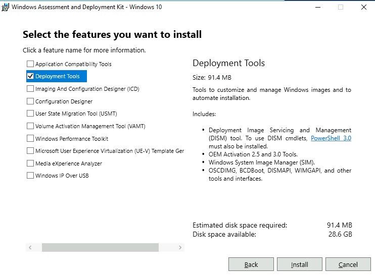
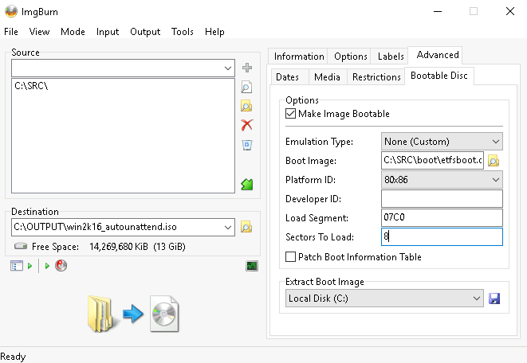

# windows-autounattended

Windows Server setup with Windows unattended install.

## The Goal

To automate Windows Server installation by using an answer file in order to prevent all of the user interface pages from Windows Setup from being displayed during installation.

There are three steps to the process:

1. Download Windows Server ISO file.
2. Create an answer file `autounattend.xml`.
3. Add the answer file `autounattend.xml` to the Windows Server ISO image.

## Download Windows Server ISO

Navigate to one of the URLs below for your intended server version:

* https://www.microsoft.com/en-us/evalcenter/evaluate-windows-server-2016
* https://www.microsoft.com/en-us/evalcenter/evaluate-windows-server-2019

Download the Windows Server evaluation ISO.

## Create autounattend.xml

I used the Windows System Image Manager (Windows SIM) to create an unattended Windows Setup answer file. Windows SIM is included with the Windows Assessment and Deployment Kit (Windows ADK.) You can download the Windows ADK [from Microsoft website](https://learn.microsoft.com/en-us/windows-hardware/get-started/adk-install).



I also used Windows Setup reference that describes all of the unattended settings that can be set in Windows Server 2016/2019. Link below for references.

https://docs.microsoft.com/en-us/windows-hardware/customize/desktop/unattend/components-b-unattend

It was a lengthy process based on trial and error.

## Add autounattend.xml to ISO

Use ImgBurn to create an ISO file from a directory. Navigate to "Advanced > Bootable Disk" and tick the box to "Make Image Bootable".

Set "Source" as `C:\SRC\`. Set "Destination" as `C:\OUTPUT\win2k16_autounattend.iso`.

Use `boot\etfsboot.com` file from the DVD for "Boot Image".

Set "Sectors To Load" to 8 when setting up a Windows Server 2016.



## Windows Server Management with Ansible

Ansible can manage Windows versions under current support from Microsoft. Unlike Linux hosts that use SSH by default, Windows hosts are configured with WinRM.

Open PowerShell as Administrator, and run the following commands to configure CredSSP authentication:

```
$url = "https://raw.githubusercontent.com/lisenet/windows-autounattend/master/ConfigureRemotingForAnsibleCredSSP.ps1"
$file = "$env:temp\ConfigureRemotingForAnsible.ps1"
(New-Object -TypeName System.Net.WebClient).DownloadFile($url, $file)
powershell.exe -ExecutionPolicy ByPass -File $file
```

Verify that the Basic authentication is disabled, and that CredSSP is enabled:

```
winrm get winrm/config/Service
winrm get winrm/config/Winrs
```
